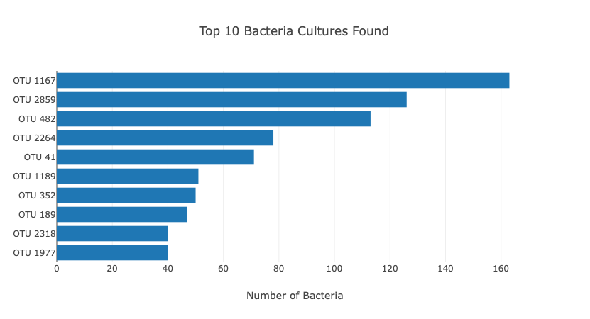
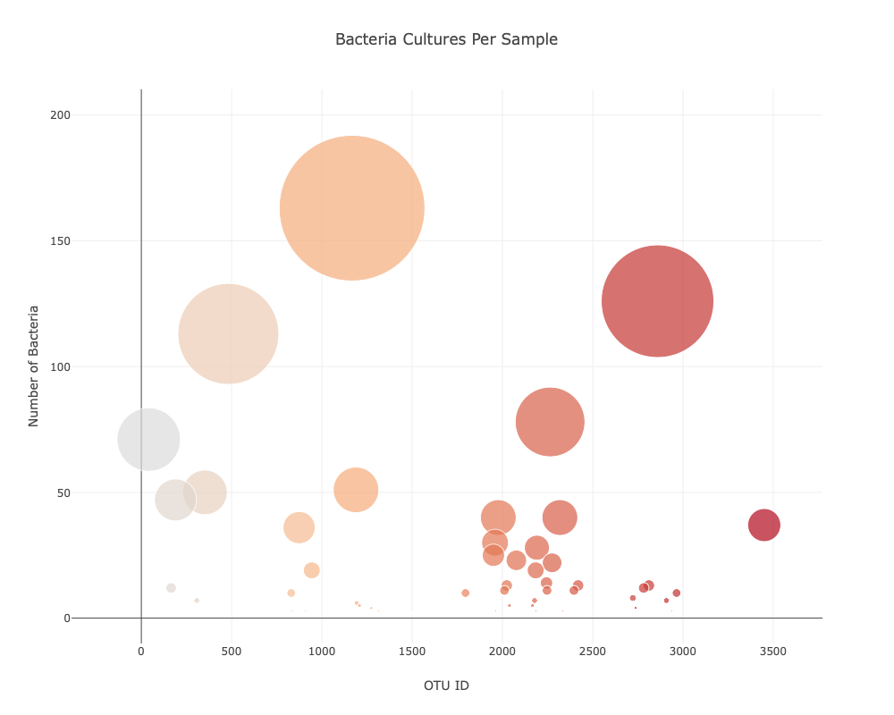

## Belly Button Biodiversity Dashboard

This project involves building an interactive dashboard to explore the **Belly Button Biodiversity** dataset, which catalogs the microbes found in human navels. The dataset highlights that only a small number of microbial species (referred to as **Operational Taxonomic Units** or **OTUs**) are prevalent in more than 70% of individuals, while the majority are rare.

### Features:
1. **Data Source**: The dataset is fetched using the D3 library from the URL: [Belly Button Biodiversity Dataset](https://static.bc-edx.com/data/dl-1-2/m14/lms/starter/samples.json).
   
2. **Horizontal Bar Chart**: 
   - Displays the top 10 OTUs found in the selected individual.
   - Uses the following data:
     - `sample_values` as the values.
     - `otu_ids` as the labels.
     - `otu_labels` as hovertext.




3. **Bubble Chart**: 
   - Displays each sample in a bubble chart.
   - Uses the following data:
     - `otu_ids` for the x-axis.
     - `sample_values` for the y-axis.
     - `sample_values` for the marker size.
     - `otu_ids` for the marker colors.
     - `otu_labels` for the hovertext.



4. **Metadata Display**: 
   - Displays the individual's demographic information from the metadata.
   - Loops through each key-value pair from the metadata JSON object and dynamically appends it to the `Demographic Info` panel.

5. **Dynamic Plot Updates**:
   - All charts and metadata are updated when a new sample is selected from the dropdown menu.
  
### Technologies Used:
- **D3.js**: To fetch and manipulate the dataset.
- **Plotly**: For creating interactive bar and bubble charts.
- **JavaScript/HTML/CSS**: For building and styling the dashboard.

### Installation:
1. Clone the repository:
   ```bash
   git clone https://github.com/jhammans/belly-button-challenge
   cd Belly_Button
   ```
2. Open `index.html` in your browser to view the dashboard locally.

### Project Structure:
- `index.html`: Main HTML file for the dashboard.
- `app.js`: Contains the JavaScript code for data fetching, visualizations, and interactivity.
- `style.css`: Custom styles for the dashboard (if any).

### License:
This project is open-source and available under the [MIT License](LICENSE).

---

Feel free to explore the dataset and analyze the microbial diversity through this interactive dashboard!